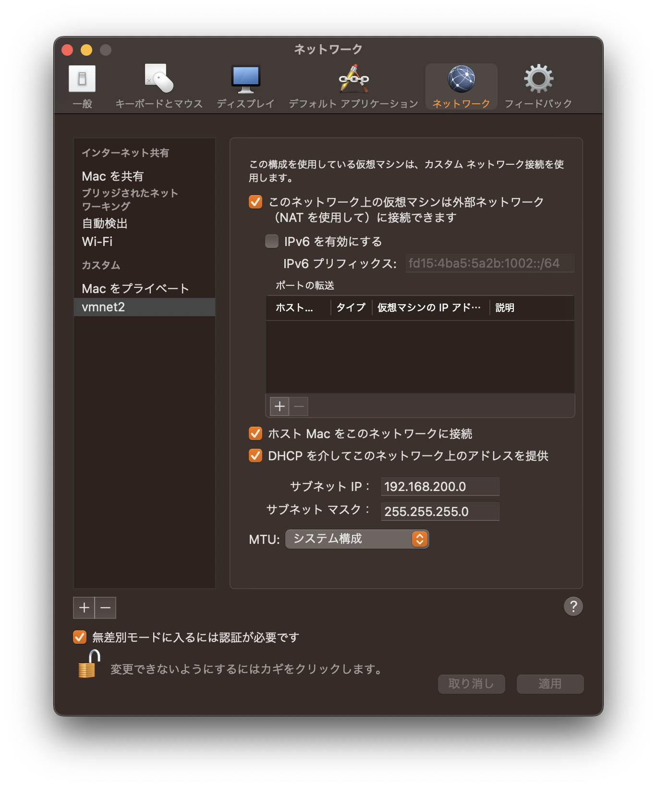

# Linux网络配置

为什么虚拟机可以访问网络？

ifconfig

NAT网络配置

虚拟机-->vmenet1-->(代理)-->主机wifi-->Internet

虚拟机   :  192.168.89.131

vmenet1  :  192.168.89.1

主机wifi :  192.168.1.3

·自动获取: 每次获取ip地址可能不一样。

·指定ip  :

# 设置mac下的vmware和虚拟机手动ip的方式

## mac vmware

步骤a:

  在mac下先找到nat.conf和dhcpd.conf，### 备份 ###之后修改地址。

  cd /Library/Preferences/VMware\ Fusion/vmnet8

  修改nat.conf默认地址192.168.89.2====>192.168.200.2

  修改dhcpd.conf如上89====>200

步骤b:

  VMware Fusion->设置->网络

  

步骤c:

  VMware 虚拟机选项菜单中选择步骤b中创建的适配器

## virtual linux

步骤d:

  linux中打开网络设置，IPV4手动设置

  静态IP                           192.168.200.xxx

  网关IP 步骤a中nat.conf修改的地址 192.168.200.2

  掩码IP 同上                      255.255.255.0

  DNS IP 母机中查看的DNS           192.168.1.1

# 修改hostname

## /etc/hostname

# 修改对应关系

## /etc/hosts

在本机的hosts中增加需要ping的机器的名字和正确IP的对应关系!!!

# hosts

一个文本文件，用来记录IP和hostname(主机名)的映射关系

# DNS

1. DNS，就是Domain Name System的缩写，域名系统

2. 是互联网上作为域名和IP地址相互映射的一个分布数据库

