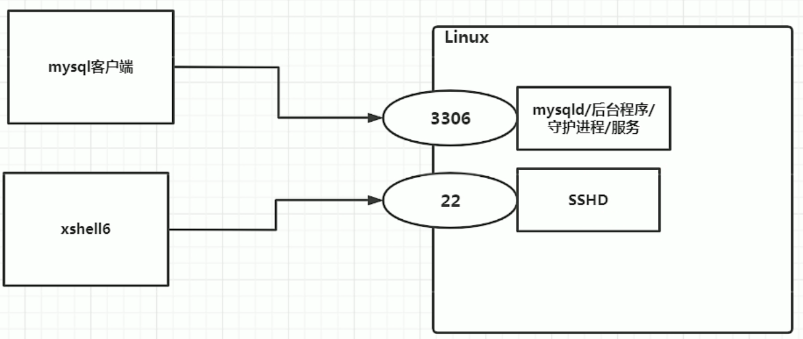
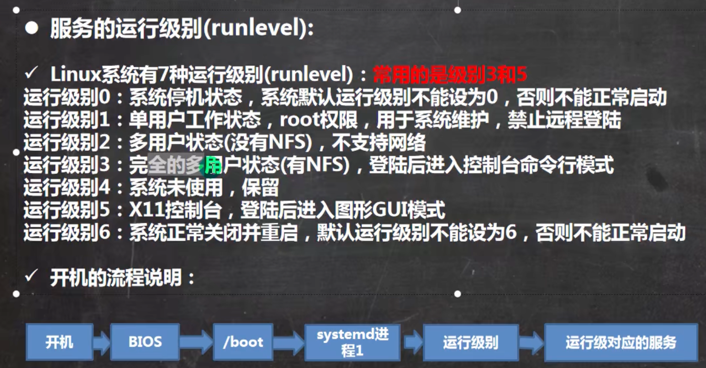
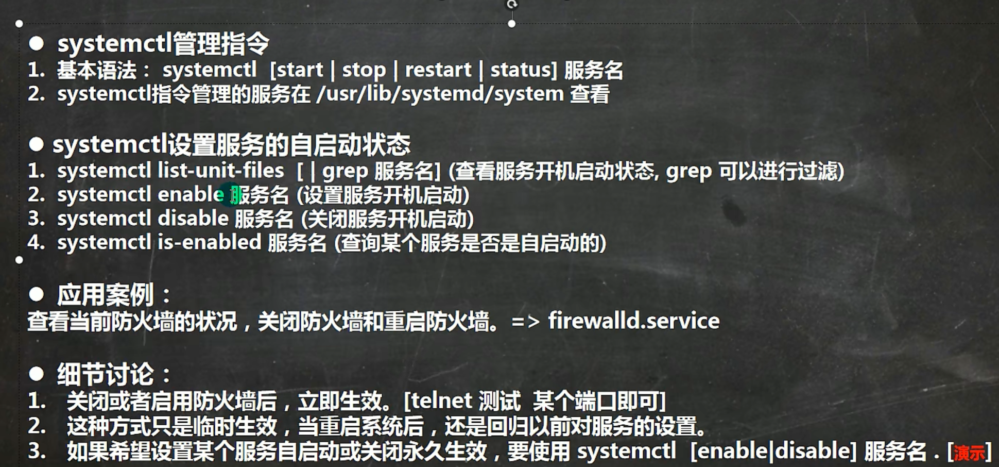

# 服务管理
## 服务/守护进程/后台程序



servie start|stop|restart|reload|status

centOS7之后systemctl代替service

service指令管理的服务在/etc/init.d

查看服务名:
systemctl list-units

## 运行级别


```
systemctl get-default
systemctl set-default multi-user.target
reboot
systemctl set-default graphic.target
reboot
```

## chkconfig指令

1. 给各个运行级别设置自 启动/关闭

2. chkconfig指令管理的服务在哪里

3. centos7之后使用systemctl

chkconfig --list [| grep xxx]

chkconfig --level 5 servicename on/off

https://bencane.com/2012/01/19/cheat-sheet-systemctl-vs-chkconfig/

## systemctl
查看服务
```
[root@fox01 ~]# ls -l /usr/lib/systemd/system | grep fire
-rw-r--r--. 1 root root  674 12月 14 05:58 firewalld.service
```
```
[root@fox01 ~]# systemctl list-unit-files | grep firewalld
firewalld.service                                                         enabled         enabled
```

```
[root@fox01 ~]# systemctl status firewalld
● firewalld.service - firewalld - dynamic firewall daemon
     Loaded: loaded (/usr/lib/systemd/system/firewalld.service; enabled; preset: enabled)
     Active: active (running) since Sat 2023-06-03 12:04:11 CST; 31min ago
       Docs: man:firewalld(1)
   Main PID: 758 (firewalld)
      Tasks: 2 (limit: 10568)
     Memory: 30.1M
        CPU: 331ms
     CGroup: /system.slice/firewalld.service
             └─758 /usr/bin/python3 -s /usr/sbin/firewalld --nofork --nopid

6月 03 12:04:11 fox01 systemd[1]: Starting firewalld - dynamic firewall daemon...
6月 03 12:04:11 fox01 systemd[1]: Started firewalld - dynamic firewall daemon.
```
查看进程是否是自启动，stop只是暂时的。

systemctl is-enabled firewalld

使用disable来禁用自启动

systemctl disable firewalld

查看某个服务名称
/usr/lib/systemd/system

# firewalld
打开端口: firewall-cmd --permanent --add-port=端口/协议
关闭端口: firewall-cmd --permanent --remove-port=端口/协议
重新载入才能生效: firewall-cmd --reload
查询端口是否开发: firewall-cmd --query-port=端口/协议
```
[root@fox01 ~]# firewall-cmd --query-port=111/tcp
no
[root@fox01 ~]# firewall-cmd --permanent --add-port=111/tcp
success
[root@fox01 ~]# firewall-cmd --reload
success
[root@fox01 ~]# firewall-cmd --query-port=111/tcp
yes
```


