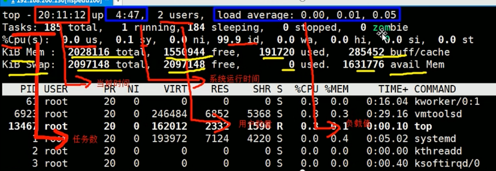

# 动态监控进程

## 与ps相似。不同在于top执行一段时间可以更新正在运行的进程。

top [opt]

-d    默认3s，更新间隔

-i    不显示闲置或僵尸进程

-p    指定进程ID仅仅监控某个进程的状态

## 交互操作
P    CPU使用率排序

M    内存***

N    PID***

q    quit

top之后输入u,查找用户;输入k结束进程,输入9强制
