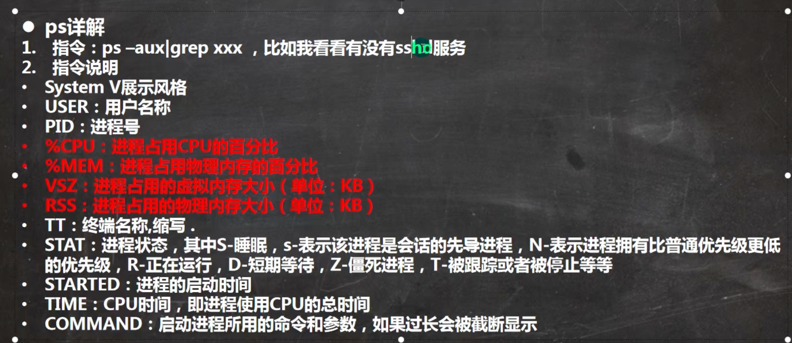

# 进程管理

## 1. Linux中每一个执行的程序都成为一个进程，每一个进程都分配一个ID pid，进程号。

## 2. 每个进程都以2中方式存在。前台与后台。

## 3. 一般系统的服务都是以后台进程的方式存在，并且会常驻在系统中。直到关机方才结束。

ps -a:
ps -u:
ps -x:
ps -aux | more

```
USER         PID %CPU %MEM    VSZ   RSS TTY      STAT START   TIME COMMAND
root           1  0.0  0.8 173312 15288 ?        Ss   20:39   0:01 /usr/lib/systemd/systemd rhgb --switched-root --system --deserialize 31
root           2  0.0  0.0      0     0 ?        S    20:39   0:00 [kthreadd]
root           3  0.0  0.0      0     0 ?        I<   20:39   0:00 [rcu_gp]
root           4  0.0  0.0      0     0 ?        I<   20:39   0:00 [rcu_par_gp]
root           5  0.0  0.0      0     0 ?        I<   20:39   0:00 [slub_flushwq]
root           6  0.0  0.0      0     0 ?        I<   20:39   0:00 [netns]
```



查看进程
ppid: 父进程
```
[root@fox01 ~]# ps -ef | grep sshd
root         851       1  0 20:39 ?        00:00:00 sshd: /usr/sbin/sshd -D [listener] 1 of 10-100 startups
root        6755     851  0 21:26 ?        00:00:00 sshd: root [priv]
sshd        6756    6755  0 21:26 ?        00:00:00 sshd: root [net]
root        6758     851  0 21:26 ?        00:00:00 sshd: tom [priv]
tom         6780    6758  0 21:26 ?        00:00:00 sshd: tom@pts/1
root        6858    6821  0 21:27 pts/1    00:00:00 grep --color=auto sshd

```
